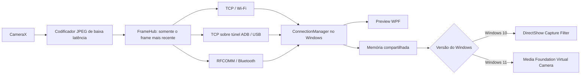

# Arquitetura

## Visão geral

O Android comprime cada frame apenas uma vez e o publica para todos os clientes. Cada cliente tem uma fila de tamanho um: se o consumidor estiver lento, o frame antigo é descartado. Isso evita que latência se acumule, especialmente no Bluetooth.

O desktop pode manter mais de uma sessão com o mesmo `deviceId`. Cada sessão mede latência, idade do último frame e falhas consecutivas. O árbitro pontua as rotas e entrega ao preview apenas os frames da rota ativa.

## Transportes

| Transporte | Descoberta | Canal | Prioridade base | Uso recomendado |
|---|---|---|---:|---|
| USB | `adb devices` + `adb forward` | protocolo PocketCam sobre TCP encapsulado no ADB USB | 300 | 720p/1080p, 30 FPS |
| Wi-Fi | Android NSD e beacon UDP | TCP com `NoDelay`, keep-alive e frames descartáveis | 200 | 480p/720p, 15–30 FPS |
| Bluetooth | SDP/RFCOMM com UUID fixo | stream RFCOMM | 100 | 240p/360p, 5–10 FPS |

USB via ADB foi escolhido porque usa o driver oficial do fabricante/Google, funciona sem instalar um driver de câmera em modo kernel e mantém boa vazão. A primeira conexão exige que o usuário habilite a depuração USB e aceite a chave do computador.

Bluetooth é uma rota de contingência. RFCOMM oferece stream confiável e disponibilidade muito maior que L2CAP customizado no ecossistema Android/Windows, mas sua vazão prática é insuficiente para vídeo HD.

## Seleção e failover

Uma rota saudável recebe a prioridade base, bônus de estabilidade e penalidades por latência/falhas. A mudança para uma rota melhor exige uma vantagem mínima por um pequeno período de estabilidade; a perda da rota ativa ignora a histerese e troca imediatamente. As conexões secundárias continuam lendo frames, portanto não existe novo handshake no momento do failover.

## Segurança

- somente clientes que completam o handshake versionado recebem frames;
- limites de payload e CRC32 protegem o parser contra dados inválidos;
- Bluetooth usa o pareamento do sistema operacional;
- o protocolo v1 é para rede local confiável e não oferece criptografia. Uma versão futura poderá negociar TLS/Noise sem alterar o cabeçalho.

## Compatibilidade da câmera virtual

O instalador escolhe o backend pelo build do sistema:

- Windows 10 versão 2004 ou posterior usa um filtro de captura DirectShow RGB32 registrado em `CLSID_VideoInputDeviceCategory`;
- Windows 11 build 22000 ou posterior usa `MFCreateVirtualCamera` e a fonte Media Foundation.

Os dois backends leem BGRA da mesma memória compartilhada publicada pelo desktop. No Windows 10, o filtro DirectShow é carregado dentro do aplicativo consumidor e não precisa de processo auxiliar. No Windows 11, o host mantém a câmera Media Foundation ativa enquanto o PocketCam está aberto. O pacote atual é x64 e, portanto, destina-se a aplicativos de videoconferência x64.
